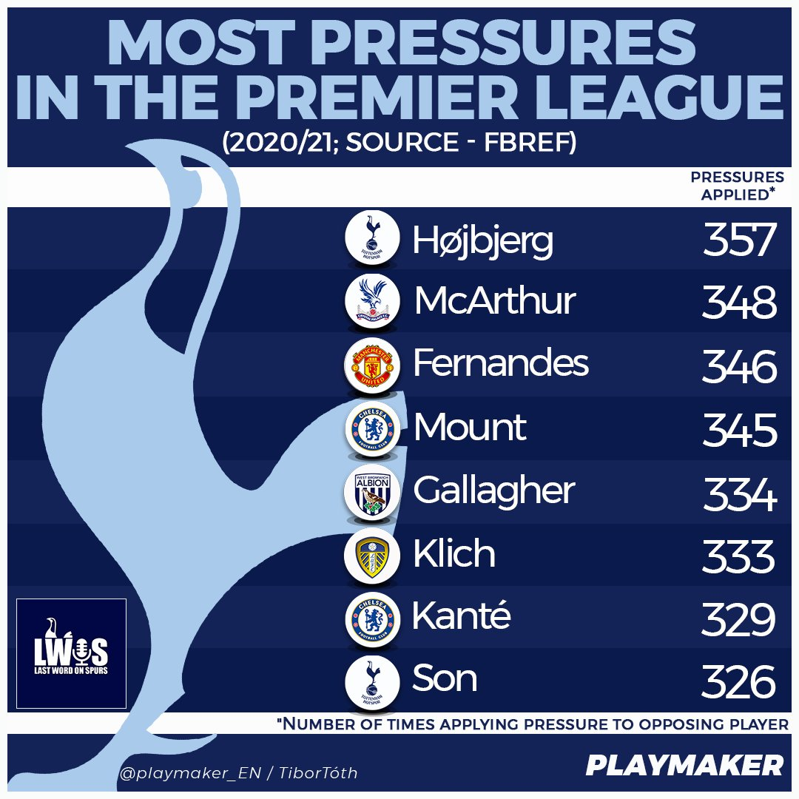
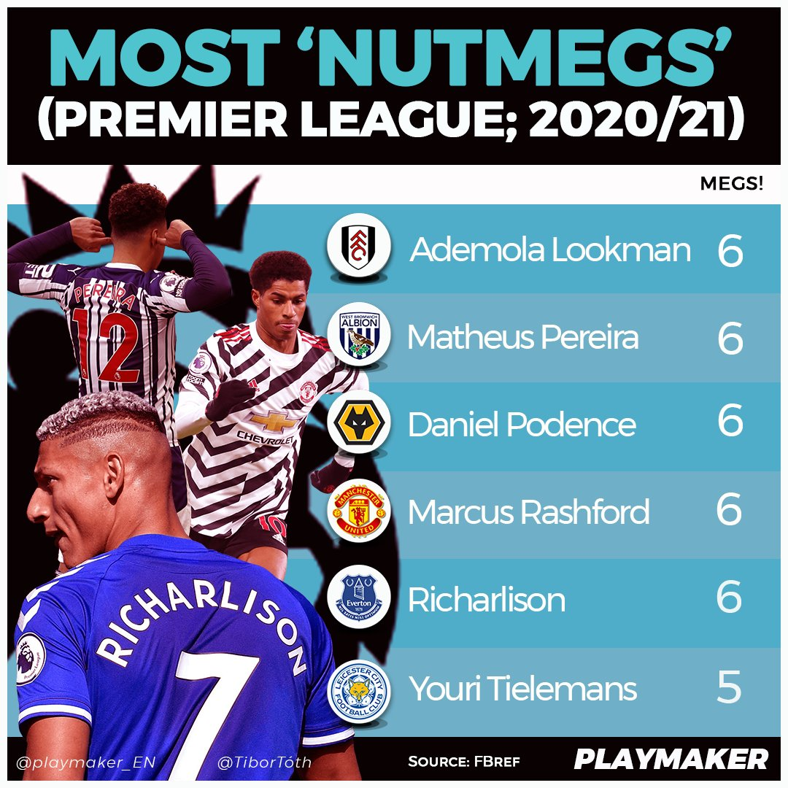
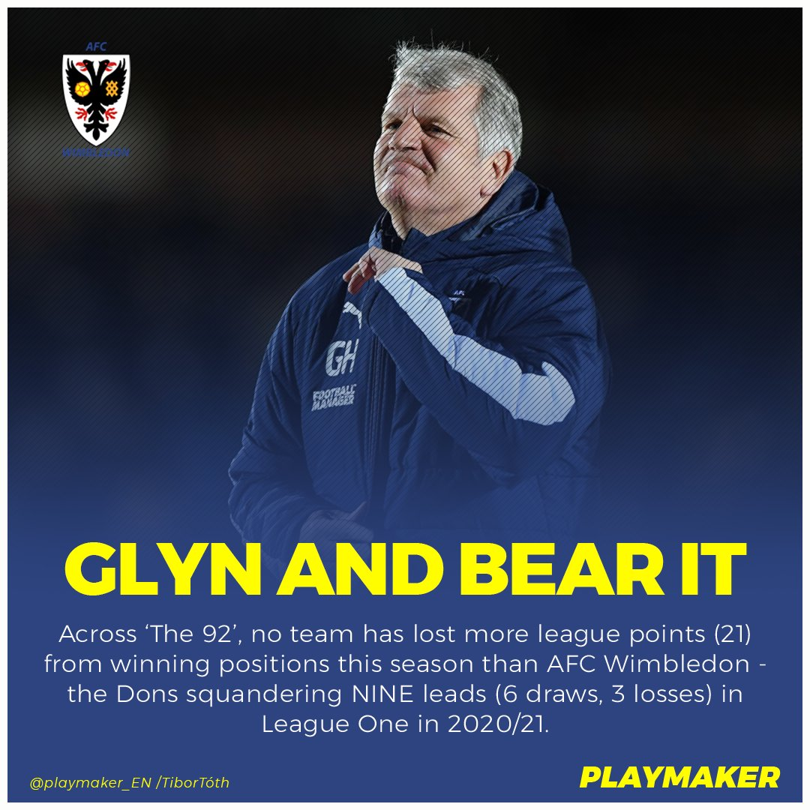
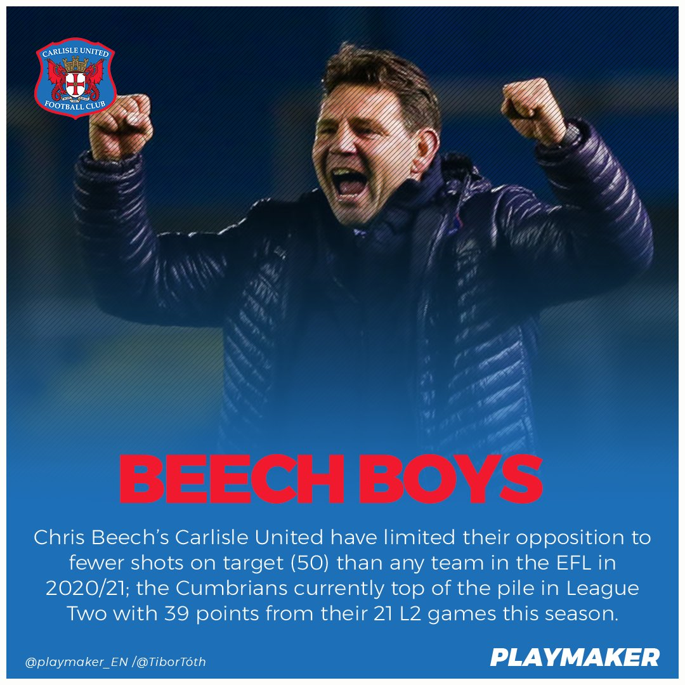
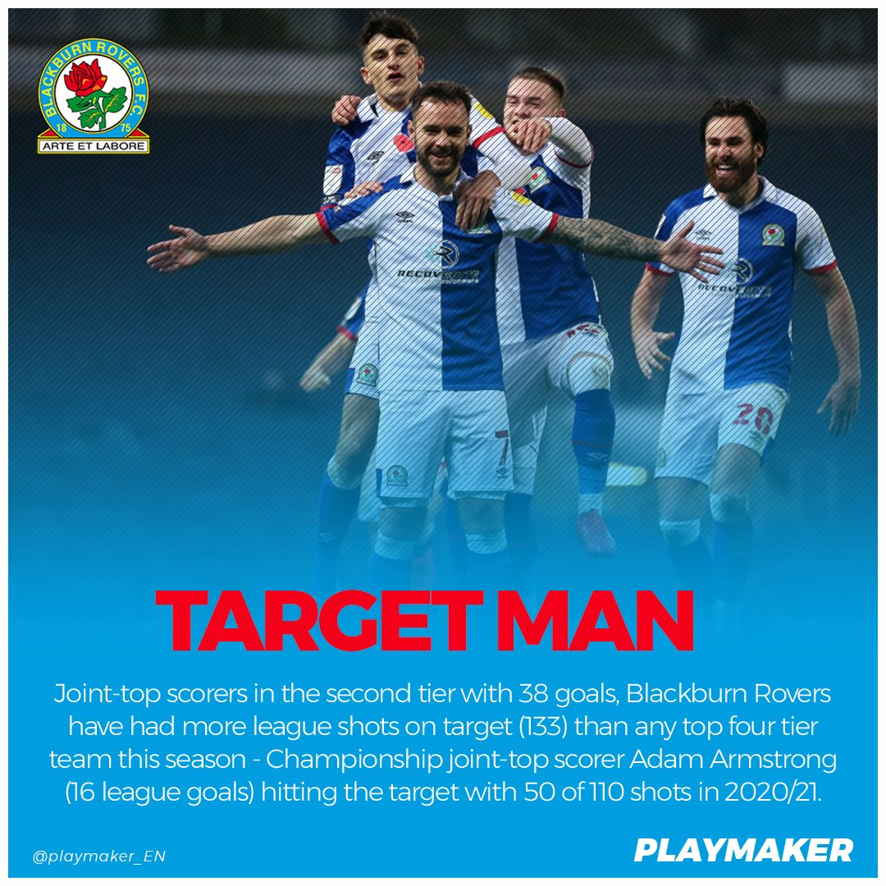
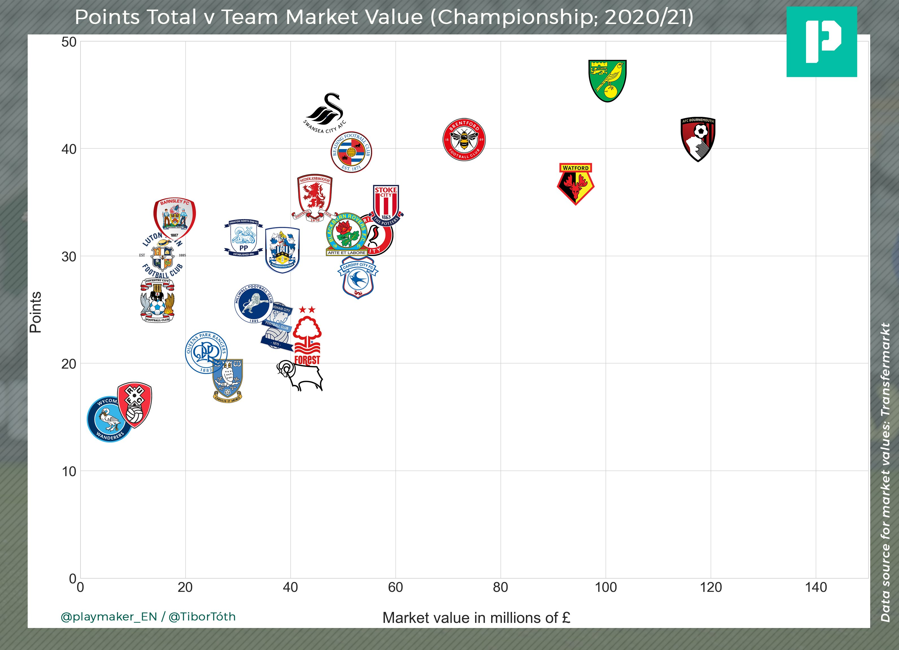
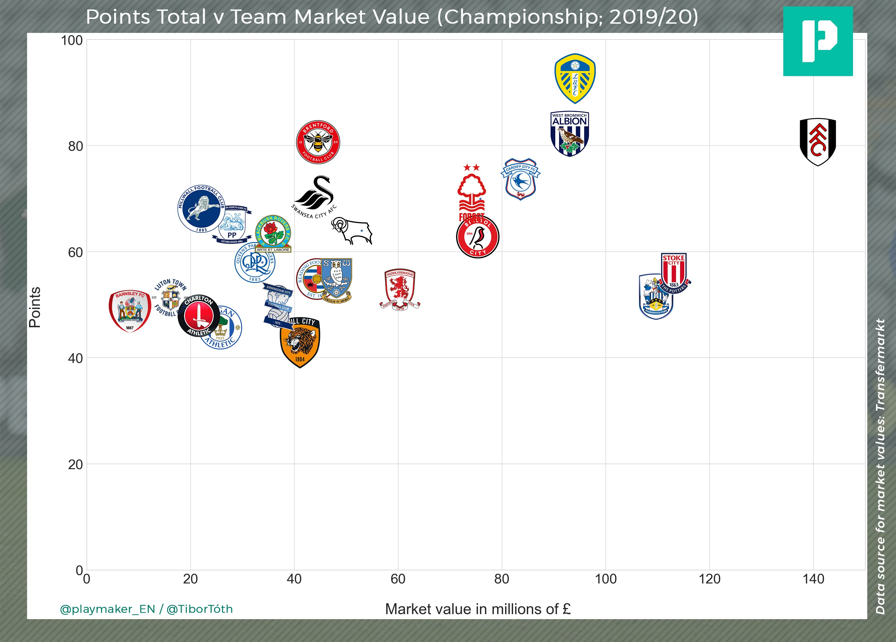
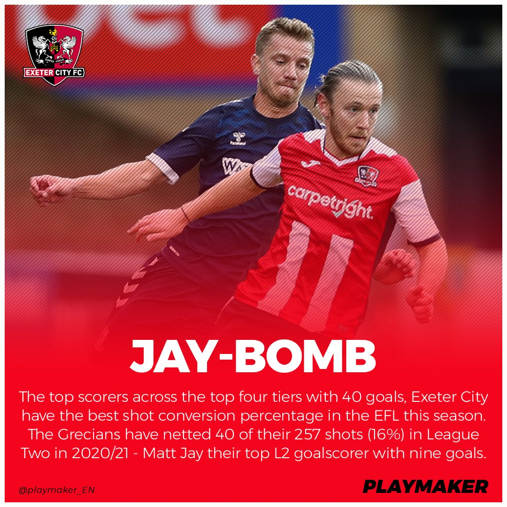
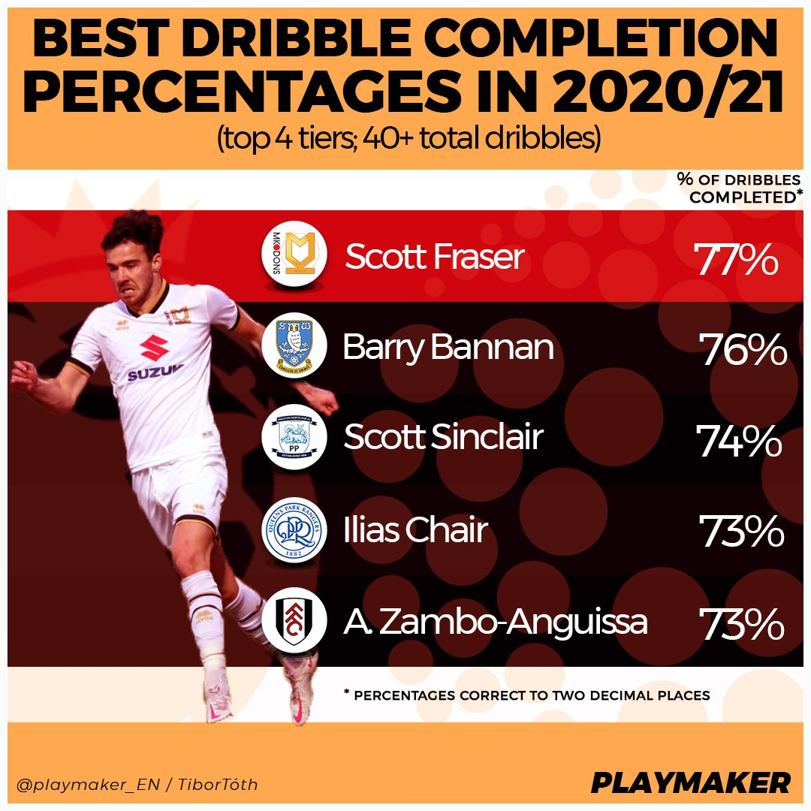
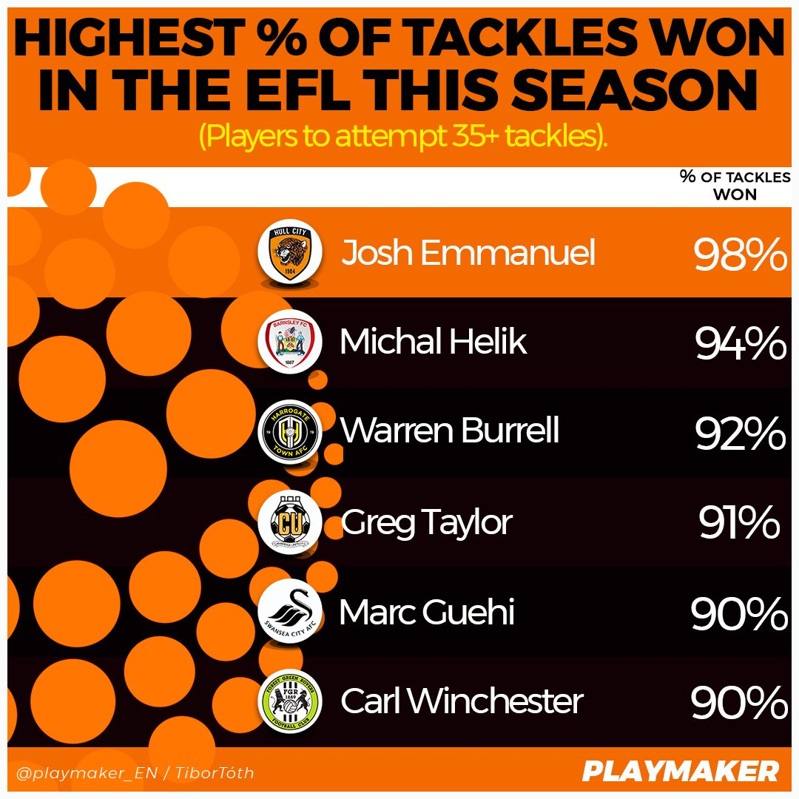

# playmaker_EN
Statistics provided for [@playmaker_EN](https://twitter.com/playmaker_EN)

# Tweets

## 2021 Jan 21

Most pressures* in 2020/21 (Premier League):

- 357: Højbjerg
- 348: McArthur
- 346: Fernandes
- 345: Mount
- 334: Gallagher
- 333: Klich
- 329: Kanté
- 326: SON

*no. of times pressure applied to opposing player.

#THFC #COYS 
@LastWordOnSpurs

## 2021 Jan 21

Most completed nutmegs in 2020/21 (Premier League):

- 6: Lookman, Pereira, Podence, Rashford, Richarlison
- 5: Tielemans
- 4: Bamford, Benrahma, Bernard, Cancelo, Eze, Mount, Neto, B Traoré, Zaha

#FFC #WBA #Wolves #MUFC #EFC

## 2021 Jan 20

Most completed nutmegs this season (Premier League):

- 22: LEEDS*
- 20: Everton
- 17: Chelsea, Wolves
- 16: Spurs
- 14: Fulham, Leicester, Man C

*Bamford x4; Ayling, Harrison x3; Alioski, Costa, Klich, Poveda, Raphinha x2; Phillips, Struijk x1  

#LUFC @LUFC

## 2021 Jan 19

Most league points dropped from winning positions (top 4 tiers; 2020/21):

- 21: AFC WIMBLEDON*
- 16: Birmingham, Plymouth, Barrow, Mansfield
- 15: Huddersfield, Cheltenham
- 14: Rotherham, Sheff W, Burton, Exeter, Orient
* led in all six of their L1 draws this season.  
#EFL

## 2021 Jan 18
Fewest shots on target faced in 2020/21 (#EFL):

- 50: CARLISLE
- 51: Sunderland
- 59: Hull
- 61: Blackpool, Doncaster
- 63: Boro
- 64: Watford, Portsmouth
- 66: Cheltenham 
- 67: Ipswich  
#cufc @officialcufc

## 2021 Jan 15

Chart with upwards trend Most shots on target (top 4 tiers; 2020/21):

- 133 : BLACKBURN
- 123 : Norwich
- 113 : Carlisle
- 110 : Bournemouth
- 109 : Salford
- 105 : Mansfield
- 103 : Crewe, Exeter

#Rovers @Rovers

## 2021 Jan 12

C'ship points ÷ Team market value (top half; 20/21):  

- 1.6 points-per-million: BARNSLEY
- 0.9 ppm: Preston
- 0.8 ppm: Swansea
- 0.7 ppm: Boro, Reading
- 0.6 ppm: Blackburn
- 0.5 ppm: Stoke, Bristol C, Brentford
- 0.4 ppm: Norwich, Watford
- 0.3 ppm: B'mouth  
#COYR

## 2021 Jan 8
Best #EFL shot conversion %s in 2020/21:

16%: EXETER*  
15%: Charlton  
14%: Reading, Fleetwood, Lincoln, Cambridge, Colchester, Crawley, Orient  

* 40 League Two goals from 257 shots.  

#ECFC @OfficialECFC 

## 2021 Jan 7
Highest dribble success %s (top 4 tiers; 40+ total dribbles):  

77%: @ScottFraser_  
76%: Barry Bannan  
74%: Scott Sinclair  
73%: Ilias Chair, A. Zambo-Anguissa  
72: Adama Traoré, Omar Richards, Iván Sánchez   

#MKDons @MKDonsFC  

## 2021 Jan 6

Highest % of tackles won in 2020/21 (#EFL; 35+ attempted):  

98%: Josh Emmanuel (39/40 tackles won)  
94%: Michal Helik (34/36)  
92%: Warren Burrell (35/38)  
91%: Greg Taylor (39/43)  
90%: Marc Guehi (37/41), Carl Winchester (36/40)  

#hcafc #COYR #CamUTD #Swans #WeAreFGR  

